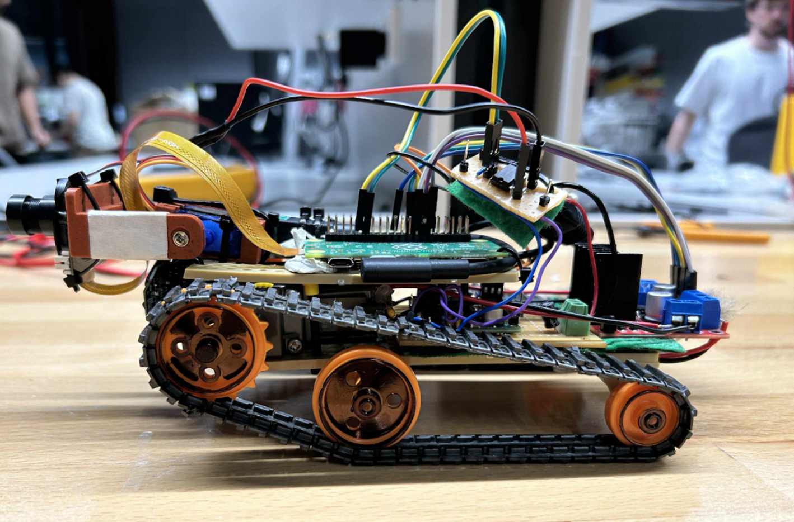

# 🦘 The BushBot Initiative  

Welcome to the **BushBot Initiative** — an AI-powered wildlife monitoring platform designed for the **non-intrusive observation** of Australian fauna.  

The system combines an intelligent **Raspberry Pi–based payload** (camera, microphone, and light sensor) with a **host PC** that performs real-time species detection, classification, and peripheral control. Together, they provide a compact, efficient, and environmentally conscious solution for wildlife research and education.

---

## 🧩 System Overview

The BushBot architecture consists of three main components:

- **Onboard Payload:** Captures video, audio, and ambient light data in real time.  
- **Host PC:** Runs AI inference, GUI, data logging, and remote command functions.  
- **Communication Link:** Wi-Fi channel enabling live control, telemetry, and data transmission between the host and payload.

This modular design allows for easy maintenance, flexible upgrades, and seamless collaboration between electrical and robotics systems.

---

## 📸 The BushBot Prototype

  

> *Figure 1. The BushBot sensor payload integrated with the R03 robotic base.  
> The design incorporates a Raspberry Pi–based controller, onboard camera, microphone, IR filter, and tilt mechanism for adaptive wildlife monitoring.*

---

## 🚀 Quick Start

1. Begin with the [Getting Started](getting_started.md) guide to configure your Raspberry Pi and host PC.  
2. Refer to the [Operation](operation.md) section for day-to-day use.  
3. Check the [Troubleshooting](troubleshooting.md) page for diagnostic help.  
4. Review the [Safety Manual](safety.md) before powering or handling the system.

---

> Developed by **Team E18** — Monash Engineering, 2025.  
> For source code and setup scripts, visit the official repository:  
> 🔗 [github.com/kaladeens/e18](https://github.com/kaladeens/e18)
